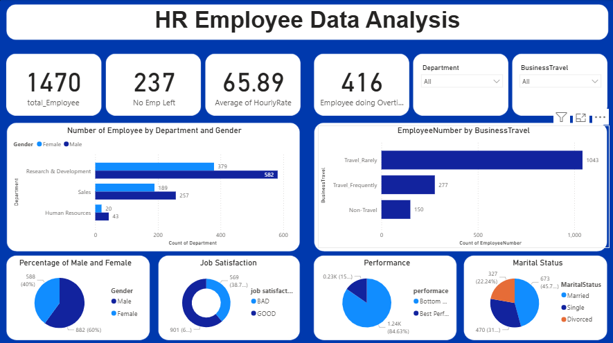
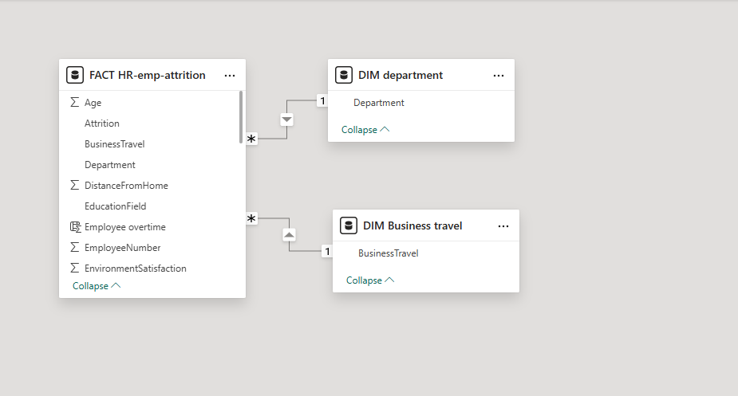

# HR Employee Data Analysis - Power BI

## 📌 Project Overview
This project is a **Power BI dashboard** that analyzes HR employee data to uncover patterns and insights in:
- Workforce demographics
- Attrition and retention trends
- Department-wise and gender distribution
- Employee performance and satisfaction

## 🛠 Tools & Technologies
- **Power BI** → Dashboard creation & data visualization
- **Excel / CSV Dataset** → Data source

## 📊 Key Insights
1. **Total Employees:** 1,470
2. **Attrition:** 237 employees left
3. **Average Hourly Rate:** $65.89
4. **Overtime Workers:** 416 employees
5. **Highest Attrition:** Sales department
6. **Gender Ratio:** 60% Male, 40% Female

## 📷 Dashboard Preview

## 📂 Files Included
- `Dashboard.pbix` → Power BI report file
- `employee_data.csv` → Dataset used (if shared)
- `Dashboard.png` → Dashboard screenshot

## 🚀 How to Use
1. Download the `.pbix` file.
2. Open in **Power BI Desktop**.
3. Connect or update the dataset if required.

---
**Created by:** [Sasikumar Anadan](https://github.com/Sasikumar69)
